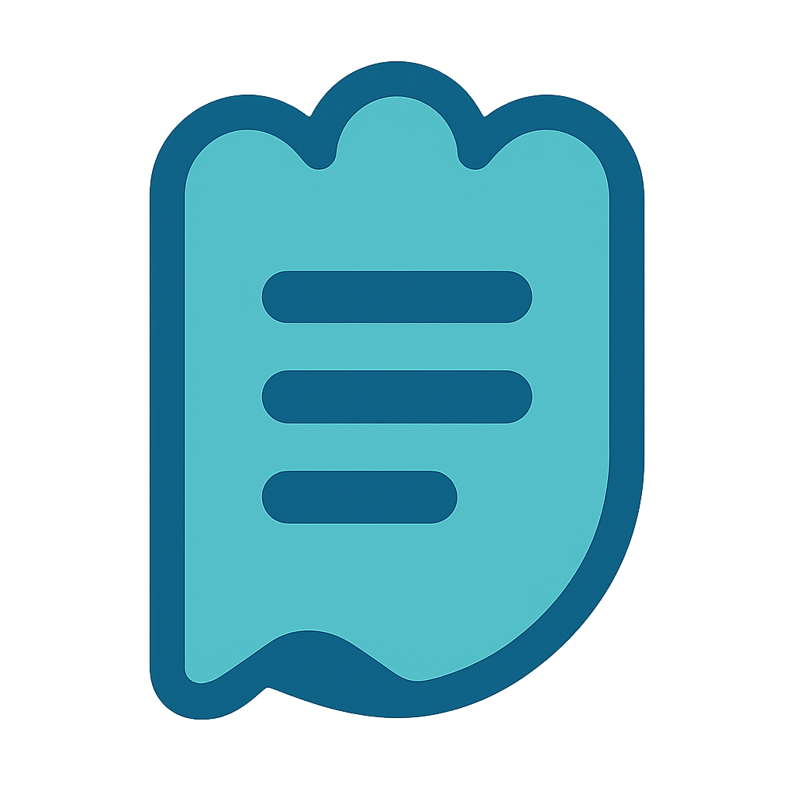

<p align="center">
  
</p>

<h1 align="center">GhostPad</h1>

<p align="center">
  <strong>A lightweight, Windows 11 Notepad-style text editor for KDE Plasma.</strong>
</p>

<p align="center">
  
  
  
  
  
  
  
  
</p>

---

## Overview

GhostPad is a fast, minimal text editor for Linux that brings the familiar feel
of Windows 11 Notepad to KDE Plasma on Wayland. It is built in Rust with a Qt 6
/ Kirigami UI bridged through [cxx-qt](https://github.com/KDAB/cxx-qt). There is
no telemetry and no network access — it is a local editor that "just works".

## Screenshots

> _Screenshots coming soon._

## Features

- **Tabbed editing** — work on multiple documents at once, with unsaved-change
  prompts.
- **Find & replace** — incremental search with case-sensitive, whole-word, and
  regular-expression modes, highlight-all overlays, and a match counter.
- **Encodings & line endings** — UTF-8, UTF-16LE, UTF-16BE, ISO-8859-1; LF or
  CRLF, switchable per document.
- **Autosave & crash recovery** — open documents are snapshotted every minute and
  restored on the next launch.
- **External-change detection** — files are watched on disk; reload or dismiss
  when something changes underneath you.
- **Read-only awareness** — locked files are flagged, with an explicit override.
- **Word wrap, monospace fonts, line/column status**, and the standard editing
  shortcuts (undo/redo, cut/copy/paste, select all, duplicate line).
- **KDE-native chrome** — optional KWin blur and window shadow.

## Themes

GhostPad ships six themes, selectable in **Settings → Appearance**:

| Theme | Description |
|-------|-------------|
| System | Inherit the active KDE color scheme (default) |
| Light | Explicit light palette |
| Dark | Explicit dark palette |
| Tokyo Night | The classic dark "night" variant |
| Tokyo Night Storm | Lighter blue-grey background |
| Tokyo Night Moon | Cooler "moon" background |

See [docs/guides/theming.md](docs/guides/theming.md) for the palettes and how to
add a variant.

## Tech Stack

| Layer | Technology |
|-------|------------|
| Core logic | Rust (edition 2024) |
| UI | Qt 6 + Kirigami (QML) |
| Rust ↔ Qt bridge | cxx-qt |
| Desktop integration | KDE Frameworks 6 (KWindowSystem) |
| Target platform | Arch Linux · KDE Plasma · Wayland |

## Build (Arch Linux)

```bash
sudo pacman -S --needed \
    rust cargo clang pkgconf \
    qt6-base qt6-declarative \
    kirigami kwindowsystem extra-cmake-modules

git clone git@github.com:ghostkellz/ghostpad.git
cd ghostpad
cargo run -p ghostpad-app
```

Full instructions, including other distributions, are in
[docs/getting-started/build.md](docs/getting-started/build.md).

## Installation

A `PKGBUILD` is provided under `packaging/arch/`:

```bash
cd packaging/arch
makepkg -si
```

See [docs/getting-started/installation.md](docs/getting-started/installation.md)
for details and AUR usage.

## Configuration

Settings, recent documents, and window geometry are stored as JSON at
`~/.config/ghostpad/config.json`. Every field is documented in the
[settings reference](docs/reference/settings.md).

## Documentation

Browse [docs/](docs/) for getting-started guides, theming, keyboard shortcuts,
KDE integration, the settings schema, and an architecture overview.

## Contributing

Contributions are welcome — see [CONTRIBUTING.md](CONTRIBUTING.md) for setup,
code style, and the PR checklist. Security policy is in
[SECURITY.md](SECURITY.md).

## License

MIT — see [LICENSE](LICENSE).
